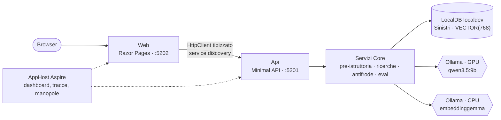

# AI.POC-AssistenteSinistri

> 🇬🇧 [English](README.md) · 🇮🇹 **Italiano**

[](https://github.com/Dusi-burg/AI.POC-AssistenteSinistri/actions/workflows/ci.yml)

Proof of concept di **RAG interamente locale** per i sinistri assicurativi: dato il testo libero di una denuncia e un numero di polizza,
prepara per il liquidatore una **scheda di pre-istruttoria** — le clausole che operano, le esclusioni da verificare, la franchigia, le
domande da fare al cliente, i sinistri simili con le statistiche di liquidazione e i possibili duplicati. Vettori di SQL Server 2025,
Ollama e .NET 10 su un portatile; nessun servizio cloud.

> **Stato**: fasi 0–9 completate — retrieval, scheda con citazioni validate, antifrode, UI web con avanzamento in streaming,
> valutazione su golden set. La Fase 10 (estensioni facoltative) non è iniziata. Tutti i dati sono **sintetici e fittizi**.



## Che cosa mostra

- **Pilastro A — catalogo semantico delle clausole.** Ricerca vettoriale su 60 clausole scritte a mano, più l'esclusione e la
  franchigia più vicine anche se non sono tra le prime 5: il modello deve vedere anche ciò che *limita* la copertura.
- **Pilastro B — ricerca ibrida.** Sinistri storici simili con i filtri SQL (prodotto, provincia, importo, causa, anni) e la distanza
  vettoriale in **una sola query**; statistiche di liquidazione (mediana compresa) calcolate **in SQL**, mai dal modello.
- **Il modello scrive, il codice decide.** La scheda è JSON con uno schema generato dal tipo C#; ogni articolo citato si verifica contro
  le clausole recuperate (quelli inventati si tolgono), gli importi che non compaiono nei dati si segnalano, i numeri arrivano da SQL.
- **Antifrode deterministica.** Quasi-duplicati per distanza coseno, con il motivo (stesso contraente, stesso riparatore), tenuti
  **fuori dal prompt**; soglie misurate con precision/recall sui duplicati inseriti apposta.
- **Qualità misurata.** Golden set di 15 casi: recall@5 **0,76**, MRR 0,92 con `embeddinggemma`, a conferma del banco di prova della
  Fase 1b (`bge-m3`: recall@5 0,58).
- **Budget hardware locale.** Su una RTX 5060 con 8 GB di VRAM la GPU è della chat; l'embedding gira su CPU (il banco di prova ha
  provato anche la NPU Ryzen AI).

## Struttura

| Percorso | Ruolo |
|---|---|
| `src/Dusiburg.AI.Sinistri.Core` | Dominio, contratti, servizi senza I/O diretto, validazione delle citazioni, rendering Markdown, opzioni |
| `src/Dusiburg.AI.Sinistri.Data` | Repository Dapper, query vettoriali e ibride, schema e lookup, probe SQL |
| `src/Dusiburg.AI.Sinistri.Ai` | Client di chat e di embedding (Microsoft.Extensions.AI + OllamaSharp), servizio di pre-istruttoria, prompt |
| `src/Dusiburg.AI.Sinistri.Ingestion` | Generatore dei dati sintetici, pipeline di embedding |
| `src/Dusiburg.AI.Sinistri.Cli` | Comandi da console |
| `src/Dusiburg.AI.Sinistri.Api` | Minimal API, stream SSE dell'avanzamento, OpenAPI |
| `src/Dusiburg.AI.Sinistri.Web` | UI Razor Pages della demo, parla solo con l'API |
| `src/Dusiburg.AI.Sinistri.AppHost`, `…ServiceDefaults` | Composizione con .NET Aspire, OpenTelemetry, health check, service discovery |
| `tools/Dusiburg.AI.Sinistri.DbInit` | Ricrea il database da zero con schema, lookup, clausole e dati sintetici |
| `tools/Dusiburg.AI.Sinistri.EmbeddingBench` | Banco di prova dell'embedding su CPU, GPU e NPU |
| `tests/*` | NUnit 4 con `Assert.That` su Microsoft.Testing.Platform |
| `data/` | Golden set e coppie di duplicati inserite apposta |
| `eval/` | Report di valutazione e output dei checkpoint |

## Prerequisiti

- **.NET SDK 10.0.4xx** (vedi `global.json`).
- **SQL Server 2025** LocalDB (versione 17.x, per il tipo `VECTOR`), istanza `localdev`: `sqllocaldb create localdev -s`.
- **Ollama** con i modelli di chat e di embedding:
  ```powershell
  ollama pull qwen3.5:9b
  ollama pull embeddinggemma
  ```
- Hardware di riferimento: RTX 5060 Laptop 8 GB + Ryzen AI 7 350. La chat gira sulla GPU; l'embedding è forzato sulla CPU
  (`EMBEDDING_NUM_GPU=0`) per non contendere la VRAM.

## Configurazione

Nessun segreto nel repository: la connection string sta negli **user-secrets dell'AppHost**, che la CLI legge a sua volta.

```powershell
dotnet user-secrets --project src/Dusiburg.AI.Sinistri.AppHost set "ConnectionStrings:sql" "Server=(localdb)\localdev;Database=Sinistri;Integrated Security=True;TrustServerCertificate=True"
```

Le **manopole** della demo si impostano sull'AppHost (user-secrets, riga di comando o variabili d'ambiente) e arrivano all'API; senza
valore vale il default del codice.

| Manopola | Default |
|---|---|
| `OLLAMA_ENDPOINT` | `http://127.0.0.1:11434` |
| `OLLAMA_CHAT_MODEL` | `qwen3.5:9b` |
| `OLLAMA_NUM_CTX` | `8192` |
| `EMBEDDING_PROVIDER` / `EMBEDDING_MODEL` / `EMBEDDING_DIMENSIONS` | `ollama` / `embeddinggemma` / `768` |
| `EMBEDDING_NUM_GPU` | `0` (CPU) |
| `SOGLIA_DUPLICATO_COSINE` | `0.05` (fraud-scan tra sinistri) |
| `SOGLIA_DUPLICATO_DENUNCIA` | `0.07` (duplicati di una nuova denuncia) |
| `SINISTRI_PROMPT_CAPTURE_DIR` | non impostata (salva ogni richiesta al modello) |
| `SINISTRI_WARMUP` | `true` (carica i modelli all'avvio dell'API) |

I parametri del retrieval (clausole, distanza delle integrative, anni di storico…) sono nella sezione `Retrieval` degli
`appsettings.json` di API e CLI.

## Da DB vuoto alla demo

```powershell
dotnet run --project tools/Dusiburg.AI.Sinistri.DbInit        # ricrea Sinistri con i dati sintetici (~5 s)
dotnet run --project src/Dusiburg.AI.Sinistri.Cli -- embed      # 880 vettori su CPU (~30 s)
dotnet run --project src/Dusiburg.AI.Sinistri.AppHost           # api + web + dashboard di Aspire
```

La Web si apre dal dashboard (`http://localhost:5202`). Solo console:

```powershell
dotnet run --project src/Dusiburg.AI.Sinistri.Cli -- ask "Dopo un temporale si è bruciata la caldaia e il televisore." --polizza CF-DEMO-000001
```

Non ci sono migration: dopo una modifica allo schema si riesegue `DbInit`, poi `embed`. La scaletta della demo è in
[docs/demo.md](docs/demo.md).

## Comandi della CLI

| Comando | Che cosa fa |
|---|---|
| `health` | Controlla SQL Server, supporto VECTOR, database, Ollama, modelli, dimensione dell'embedding e dove girano i modelli |
| `embed [--solo-mancanti] [--solo <destinazione>]` | Calcola e salva i vettori di clausole e sinistri |
| `search-clausole "<testo>" --prodotto <p>` | Pilastro A: clausole pertinenti, con esclusione e franchigia integrative |
| `search-sinistri "<testo>" --prodotto <p> [--provincia] [--importo-min] [--causa] [--anni]` | Pilastro B: ricerca ibrida e statistiche |
| `ask "<denuncia>" --polizza <numero> [--data-evento] [--causa] [--riparatore] [--out file.md] [--raw]` | Scheda di pre-istruttoria in Markdown |
| `fraud-scan [--mesi 12] [--soglia] [--valuta]` | Coppie di quasi-duplicati e precision/recall sulle coppie attese |
| `eval [--top 5] [--embedding-model <m> --embedding-provider <p> --embedding-dimensions <n>]` | Valutazione sul golden set, report in `eval/` |

## Valutazione

`eval` esegue i 15 casi di `data/golden_set.json` (denunce scritte a mano, diverse dagli scenari demo) e scrive
`eval/report_<data>_<modello>.md`. Un modello di embedding diverso si valuta su un database dedicato
(`Sinistri_emb_<provider>_<modello>`), creato e vettorizzato al volo.

| Modello di embedding | recall@5 | MRR | hit@1 | recall esclusioni (ricerca completa) |
|---|---|---|---|---|
| `embeddinggemma` (default) | **0,76** | 0,92 | 0,87 | 1,00 |
| `bge-m3` | 0,58 | 0,93 | 0,87 | 0,90 |

Antifrode sugli ultimi 12 mesi, soglia **0,05**: trovate 9 delle 10 coppie di duplicati inserite; precision 0,82 sulle coppie con
stesso contraente o riparatore, 0,08 su tutte le coppie perché i dati generati da template ripetono le stesse descrizioni.

## Build e test

```powershell
dotnet build Dusiburg.AI.Sinistri.slnx
dotnet test --solution Dusiburg.AI.Sinistri.slnx
```

I test di integrazione (`[Category("Integration")]`) usano il database LocalDB `Sinistri_Test` con vettori a 4 dimensioni scritti a
mano; nessun test chiama Ollama. La CI li salta quando la LocalDB del runner è precedente a SQL Server 2025, che non ha il tipo `VECTOR`.

## Limiti noti e sviluppi possibili

- I dati generati da template aumentano i falsi positivi del fraud-scan; il modello a volte ripete un articolo in due voci (segnalato, non corretto).
- Ricerca vettoriale esatta senza indice, adeguata a centinaia di righe; DiskANN con `VECTOR_SEARCH`, embedding in T-SQL, ricerca
  ibrida con full-text e Reciprocal Rank Fusion e un agente con tool calling sono la Fase 10, facoltativa.

## Documentazione

- [docs/il-progetto-in-breve.md](docs/il-progetto-in-breve.md) — che cosa fa l'assistente e perché ci si può fidare, per chi non sviluppa.
- [docs/architettura.md](docs/architettura.md) — la specifica, fonte di verità.
- [docs/demo.md](docs/demo.md) — preparazione, scenari e scaletta di una demo di 15 minuti.
- `docs/PLAN.md` e `docs/fase-*.md` — il piano per fasi con l'esito di ciascuna.

## Licenza

[MIT](LICENSE) © Mauro Dusi
