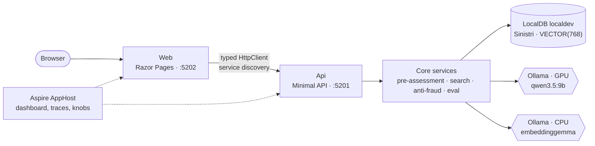

# AI.POC-AssistenteSinistri

> 🇬🇧 **English** · 🇮🇹 [Italiano](README.it.md)

[](https://github.com/Dusi-burg/AI.POC-AssistenteSinistri/actions/workflows/ci.yml)

A **fully local RAG** proof of concept for insurance claims: given a claim notice written in free text and a policy number, it prepares
a **pre-assessment sheet** for the claims handler — the policy clauses that apply, the exclusions to check, the deductible, the questions
to ask the customer, similar past claims with settlement statistics, and possible duplicates. SQL Server 2025 vectors, Ollama and .NET 10
on a laptop; no cloud service.

> **Note on language** — the domain (claims, policies, clauses) is Italian, and so are the names in the code, the prompts and the
> long-form documents under `docs/`. This README covers what you need to build, run and understand the system.

> **Status**: phases 0–9 complete — retrieval, sheet generation with validated citations, anti-fraud, web UI with streamed progress,
> evaluation on a golden set. Phase 10 (optional extensions) is not started. All data is **synthetic and fictitious**.



## What it shows

- **Pillar A — semantic clause catalogue.** Vector search over 60 hand-written policy clauses, plus the closest exclusion and
  deductible even when they are not in the top 5: the model must also see what *limits* the cover.
- **Pillar B — hybrid search.** Similar past claims with SQL filters (product, province, amount, cause, years) and the vector distance
  in **one query**; settlement statistics (median included) computed **in SQL**, never by the model.
- **The model writes, the code decides.** The sheet is JSON with a schema generated from the C# type; every cited article is checked
  against the retrieved clauses (invented ones are removed), amounts not found in the data are flagged, the numbers come from SQL.
- **Deterministic anti-fraud.** Near-duplicate claims by cosine distance, with the reason (same policyholder, same repairer), kept
  **out of the prompt**; thresholds measured with precision/recall against planted duplicates.
- **Measured quality.** A 15-case golden set: recall@5 **0.76**, MRR 0.92 with `embeddinggemma`, confirming the embedding benchmark
  of phase 1b (`bge-m3`: recall@5 0.58).
- **Local hardware budget.** On an RTX 5060 with 8 GB of VRAM the chat model owns the GPU; embeddings run on the CPU (a benchmark
  also tried the Ryzen AI NPU).

## Layout

| Path | Role |
|---|---|
| `src/Dusiburg.AI.Sinistri.Core` | Domain, contracts, services without direct I/O, citation validation, Markdown rendering, options |
| `src/Dusiburg.AI.Sinistri.Data` | Dapper repositories, vector and hybrid queries, schema and lookups, SQL probe |
| `src/Dusiburg.AI.Sinistri.Ai` | Chat and embedding clients (Microsoft.Extensions.AI + OllamaSharp), pre-assessment service, prompt builder |
| `src/Dusiburg.AI.Sinistri.Ingestion` | Synthetic data generator, embedding pipeline |
| `src/Dusiburg.AI.Sinistri.Cli` | Console commands |
| `src/Dusiburg.AI.Sinistri.Api` | Minimal API, SSE progress stream, OpenAPI |
| `src/Dusiburg.AI.Sinistri.Web` | Razor Pages demo UI, talks only to the API |
| `src/Dusiburg.AI.Sinistri.AppHost`, `…ServiceDefaults` | .NET Aspire composition, OpenTelemetry, health checks, service discovery |
| `tools/Dusiburg.AI.Sinistri.DbInit` | Recreates the database from scratch with schema, lookups, clauses and synthetic data |
| `tools/Dusiburg.AI.Sinistri.EmbeddingBench` | Embedding benchmark on CPU, GPU and NPU |
| `tests/*` | NUnit 4 with `Assert.That` on Microsoft.Testing.Platform |
| `data/` | Golden set and the planted duplicate pairs |
| `eval/` | Evaluation reports and checkpoint outputs |

## Prerequisites

- **.NET SDK 10.0.4xx** (see `global.json`).
- **SQL Server 2025** LocalDB (version 17.x, for the `VECTOR` type), instance `localdev`: `sqllocaldb create localdev -s`.
- **Ollama** with the chat and embedding models:
  ```powershell
  ollama pull qwen3.5:9b
  ollama pull embeddinggemma
  ```
- Reference hardware: RTX 5060 Laptop 8 GB + Ryzen AI 7 350. The chat runs on the GPU; embeddings are forced to the CPU
  (`EMBEDDING_NUM_GPU=0`) so they never compete for VRAM.

## Configuration

No secrets in the repository: the connection string lives in the **AppHost user-secrets**, which the CLI reads as well.

```powershell
dotnet user-secrets --project src/Dusiburg.AI.Sinistri.AppHost set "ConnectionStrings:sql" "Server=(localdb)\localdev;Database=Sinistri;Integrated Security=True;TrustServerCertificate=True"
```

Demo **knobs** are set on the AppHost (user-secrets, command line or environment variables) and forwarded to the API; without a value
the code default applies.

| Knob | Default |
|---|---|
| `OLLAMA_ENDPOINT` | `http://127.0.0.1:11434` |
| `OLLAMA_CHAT_MODEL` | `qwen3.5:9b` |
| `OLLAMA_NUM_CTX` | `8192` |
| `EMBEDDING_PROVIDER` / `EMBEDDING_MODEL` / `EMBEDDING_DIMENSIONS` | `ollama` / `embeddinggemma` / `768` |
| `EMBEDDING_NUM_GPU` | `0` (CPU) |
| `SOGLIA_DUPLICATO_COSINE` | `0.05` (fraud scan between claims) |
| `SOGLIA_DUPLICATO_DENUNCIA` | `0.07` (duplicates of a new claim notice) |
| `SINISTRI_PROMPT_CAPTURE_DIR` | not set (captures every request sent to the model) |
| `SINISTRI_WARMUP` | `true` (loads the models when the API starts) |

Retrieval parameters (top clauses, supplementary-clause distance, years of history…) are in the `Retrieval` section of the API and
CLI `appsettings.json`.

## From an empty database to the demo

```powershell
dotnet run --project tools/Dusiburg.AI.Sinistri.DbInit        # recreates Sinistri with synthetic data (~5 s)
dotnet run --project src/Dusiburg.AI.Sinistri.Cli -- embed      # 880 vectors on the CPU (~30 s)
dotnet run --project src/Dusiburg.AI.Sinistri.AppHost           # api + web + Aspire dashboard
```

Open the Web from the dashboard (`http://localhost:5202`). Console only:

```powershell
dotnet run --project src/Dusiburg.AI.Sinistri.Cli -- ask "Dopo un temporale si è bruciata la caldaia e il televisore." --polizza CF-DEMO-000001
```

There are no migrations: after a schema change re-run `DbInit`, then `embed`. The demo script is in [docs/demo.md](docs/demo.md).

## CLI commands

| Command | What it does |
|---|---|
| `health` | Checks SQL Server, VECTOR support, database, Ollama, models, embedding size and where the models run |
| `embed [--solo-mancanti] [--solo <target>]` | Computes and stores clause and claim vectors |
| `search-clausole "<text>" --prodotto <p>` | Pillar A: relevant clauses, with supplementary exclusion and deductible |
| `search-sinistri "<text>" --prodotto <p> [--provincia] [--importo-min] [--causa] [--anni]` | Pillar B: hybrid search and statistics |
| `ask "<notice>" --polizza <number> [--data-evento] [--causa] [--riparatore] [--out file.md] [--raw]` | Pre-assessment sheet in Markdown |
| `fraud-scan [--mesi 12] [--soglia] [--valuta]` | Near-duplicate pairs and precision/recall against the planted pairs |
| `eval [--top 5] [--embedding-model <m> --embedding-provider <p> --embedding-dimensions <n>]` | Golden-set evaluation, report in `eval/` |
| `export-clausole [--out docs/clausole.md]` | Writes the clause catalogue as Markdown ([docs/clausole.md](docs/clausole.md)) |
| `bench-search [--sinistri 50000] [--ripetizioni 50] [--k 10]` | Exact scan vs DiskANN index with `VECTOR_SEARCH` on a dedicated database, report in `eval/` |

## Evaluation

`eval` runs the 15 cases of `data/golden_set.json` (hand-written notices, different from the demo scenarios) and writes
`eval/report_<date>_<model>.md`. A different embedding model is evaluated on its own database (`Sinistri_emb_<provider>_<model>`),
created and embedded on the fly.

| Embedding model | recall@5 | MRR | hit@1 | exclusions recall (full search) |
|---|---|---|---|---|
| `embeddinggemma` (default) | **0.76** | 0.92 | 0.87 | 1.00 |
| `bge-m3` | 0.58 | 0.93 | 0.87 | 0.90 |

Anti-fraud on the last 12 months, threshold **0.05**: 9 of the 10 planted duplicate pairs found; precision 0.82 on pairs sharing the
policyholder or the repairer, 0.08 on all pairs because the template-generated data repeats the same descriptions.

## Build and test

```powershell
dotnet build Dusiburg.AI.Sinistri.slnx
dotnet test --solution Dusiburg.AI.Sinistri.slnx
```

Integration tests (`[Category("Integration")]`) run on a `Sinistri_Test` LocalDB database with hand-written 4-dimensional vectors; no
test calls Ollama. CI skips them when the runner's LocalDB is older than SQL Server 2025, which lacks the `VECTOR` type.

## Known limits and next steps

- Template-generated data inflates the fraud scan's false positives; the model sometimes repeats an article in two entries (flagged, not fixed).
- Exact vector search without an index. Phase 10.1 benchmarked it at 50,000 claims: 96 ms on average, against 14 ms for a DiskANN index
  with `VECTOR_SEARCH` (`TOP_N` = 20×k, same results). On SQL Server 2025 the index is a preview feature, filters apply after the
  approximate search and the table becomes read-only, so the demo database does not use it.
- Embeddings in T-SQL, full-text hybrid search with Reciprocal Rank Fusion, a reranker and a tool-calling agent are the other optional
  phase 10 extensions.

## Further documentation (Italian)

- [docs/il-progetto-in-breve.md](docs/il-progetto-in-breve.md) — what the assistant does and why you can trust it, for non-developers.
- [docs/architettura.md](docs/architettura.md) — the specification, and the source of truth.
- [docs/demo.md](docs/demo.md) — preparation, scenarios and a 15-minute demo script.
- [docs/clausole.md](docs/clausole.md) — the catalogue of the 60 (fictitious) policy clauses, generated from the database.
- `docs/PLAN.md` and `docs/fase-*.md` — the phased plan with the outcome of every phase.

## License

[MIT](LICENSE) © Mauro Dusi
