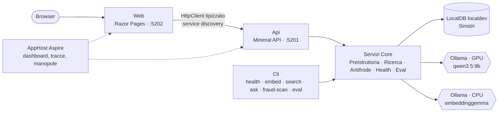

# Architettura — Assistente pre-istruttoria sinistri

> Specifica del POC: è la fonte di verità su cosa fa il sistema e perché. Il piano di lavoro sta in `PLAN.md` e nei file `fase-N.md`,
> con gli esiti di ogni fase; questo documento raccoglie il risultato finale. I dati sono tutti **sintetici e fittizi**.

## Come usare questo documento

- Per **avviare la demo**: [`demo.md`](demo.md). Per **installare e configurare**: il [README](../README.it.md).
- Per capire **una scelta**: la sezione 12 elenca le decisioni con la fase in cui sono state prese; il dettaglio e le misure stanno
  nel file della fase.
- I nomi di dominio sono in italiano (`Sinistro`, `Polizza`, `Clausola`), quelli di infrastruttura in inglese (`Repository`, `Service`).

## 1. Obiettivo

Data una denuncia di sinistro scritta in linguaggio libero e un numero di polizza, il POC prepara una **scheda di pre-istruttoria**
per il liquidatore:

1. recupera polizza e contraente (SQL classico);
2. trova le **clausole pertinenti** — garanzie, esclusioni, franchigie — con la ricerca vettoriale (*pilastro A, catalogo semantico*);
3. trova i **sinistri storici simili** con una ricerca ibrida, vettori più filtri SQL (*pilastro B*), e ne calcola in SQL le statistiche
   di liquidazione;
4. fa generare al modello locale la scheda, in JSON con schema, con le **citazioni degli articoli validate** contro le clausole recuperate;
5. segnala i **possibili duplicati** con un controllo deterministico, fuori dal prompt.

Tutto gira in locale: SQL Server 2025 (tipo `VECTOR`), Ollama con `qwen3.5:9b` per la chat e `embeddinggemma` per i vettori,
.NET 10 con Aspire. Non ci sono autenticazione né deploy: sono non-obiettivi del piano.

Il principio che attraversa il progetto: **il modello scrive, il codice decide**. I numeri li calcola SQL, gli articoli citati si
verificano, i duplicati li trova una soglia di distanza.

## 2. Componenti

| Progetto | Ruolo |
|---|---|
| `Core` | dominio, contratti, servizi senza I/O diretto (`RicercaService`, `AntifrodeService`, `EvalService`), validazione delle citazioni, rendering Markdown, opzioni |
| `Data` | repository Dapper, query vettoriali e ibride, schema e lookup (`DatabaseInitializer`), probe SQL |
| `Ai` | client di chat e di embedding (Microsoft.Extensions.AI + OllamaSharp), `PreIstruttoriaService`, `PromptBuilder`, probe Ollama |
| `Ingestion` | generatore dei dati sintetici, pipeline di embedding |
| `Cli` | comandi da console (System.CommandLine) |
| `Api`, `Web` | demo dal browser (Fase 8); la Web parla solo con l'API |
| `AppHost`, `ServiceDefaults` | avvio con Aspire, OpenTelemetry, health check, service discovery |
| `tools/DbInit` | ricrea il DB da zero con schema, lookup, clausole e dati sintetici |
| `tools/EmbeddingBench` | banco di prova dei modelli di embedding su CPU, GPU e NPU (Fase 1b) |

## 3. Modello dati

Tabelle al singolare, PK numerica `Id`, chiavi di business come colonne univoche, enum come tabelle di lookup con PK uguale al valore
dell'enum (righe generate dal codice), nessuna migration: il DB si ricrea con `DbInit` (`db/002_schema.sql`).

| Tabella | Contenuto | Colonne vettoriali |
|---|---|---|
| `Prodotto`, `TipoClausola`, `CausaSinistro`, `StatoSinistro`, `EmbeddingProvider` | lookup dagli enum | — |
| `Contraente` | 150 contraenti sintetici | — |
| `Polizza` | ~200 polizze, `Numero` univoco; 3 polizze demo fisse | — |
| `Clausola` | 60 clausole scritte a mano (35 casa, 25 RC professionale), univoche per prodotto e articolo | `Embedding` |
| `Riparatore` | 12 riparatori | — |
| `Sinistro` | ~410 sinistri generati da template, `Numero` univoco (`SIN-2026-000123`) | `Embedding`, `EmbeddingAntifrode` |
| `EmbeddingInfo` | riga unica: modello, runtime e dimensione dei vettori salvati | — |

La dimensione di `VECTOR(n)` viene da `EMBEDDING_DIMENSIONS` al momento di `DbInit`, mai scritta a mano; `health` e `embed` verificano
che colonne, configurazione ed `EmbeddingInfo` coincidano, così non si confrontano vettori di modelli diversi.

## 4. Testi vettorializzati

`EmbeddingTextBuilder` compone i testi, `EmbeddingService` aggiunge il prefisso del profilo del modello: per `embeddinggemma`
`task: search result | query: ` per le interrogazioni e `title: none | text: ` per i documenti.

| Vettore | Testo | Usato da |
|---|---|---|
| `Clausola.Embedding` | `"{Tipo} - {Titolo}. {Testo}"` | pilastro A |
| `Sinistro.Embedding` | `"Causa: {causa}. {Descrizione} Esito perizia: {esito}"` (esito omesso se assente) | pilastro B, fraud-scan |
| `Sinistro.EmbeddingAntifrode` | solo `Descrizione` | duplicati di una nuova denuncia |
| denuncia (query) | testo, con `"Causa: …"` davanti se indicata | pilastri A e B |
| denuncia (documento) | solo testo | duplicati di una nuova denuncia |

## 5. Pilastro A — clausole pertinenti

Una sola query (`ClausolaRepository`): distanza coseno esatta sulle clausole del prodotto, le prime `TopClausole` (5) più la
**migliore esclusione** e la **migliore franchigia** entro `DistanzaMaxClausolaIntegrativa` (0,70) se non sono già tra le prime
(D10, "integrative"). Se nessuna franchigia è stata scelta si aggiunge la **franchigia di base** `Art. 4.1` a qualunque distanza
(CHECKPOINT 6). Il modello deve vedere anche ciò che limita la copertura.

Con ~35 clausole per prodotto la scansione esatta è istantanea: nessun indice vettoriale (DiskANN è un'estensione della Fase 10).

## 6. Pilastro B — storico con ricerca ibrida e statistiche

`SinistroRepository.CercaSimiliAsync`: una query con i filtri SQL (prodotto, stati chiuso o respinto, anni di storico, provincia,
liquidato minimo, causa) e l'ordinamento per distanza; `TopSinistri` (10) risultati. Le **statistiche** (numero di casi, % respinti,
liquidato minimo, mediana con `PERCENTILE_CONT`, massimo) le calcola SQL sugli `Id` dei simili mostrati (D11): tabella e statistiche
corrispondono sempre, e il modello non fa conti.

## 7. Scheda di pre-istruttoria

`PreIstruttoriaService.GeneraAsync`, un passo cronometrato e uno span di telemetria ciascuno:

| # | Passo | Dettaglio |
|---|---|---|
| 1 | polizza | inesistente → 404 / uscita 2; data evento fuori validità → 422; senza data e polizza scaduta oggi → avviso |
| 2 | embedding | un solo vettore della denuncia (query) per entrambe le ricerche |
| 3 | clausole | pilastro A; nessuna clausola → embedding mancanti (503) |
| 4 | storico, statistiche | pilastro B |
| 5 | generazione scheda | `qwen3.5:9b`, temperatura 0,1, `think = false`, `num_ctx` 8192, **schema JSON generato dal tipo** `SchedaPreIstruttoria` |
| 6 | antifrode | duplicati della denuncia (sezione 8), fuori dal prompt |

**Prompt** (`PromptBuilder`, puro): system prompt con 9 regole — solo le clausole fornite, articolo esattamente come scritto, ogni
articolo in una sola sezione, motivazione legata al contenuto della clausola, punti da chiarire se mancano informazioni, nessun
importo inventato e nessun calcolo, solo esclusioni che i fatti potrebbero rendere applicabili, tono professionale, risposta solo JSON —
e messaggio utente con dati polizza, denuncia, clausole numerate `[C1] Art. x (Tipo) — Titolo`, i primi 5 simili e le statistiche.

**Parsing e validazione**: JSON non valido → un retry con l'errore, poi fallback in testo libero (segnalato). `CitazioniValidator`
normalizza gli articoli (`art 2.4`, `Articolo 2.4`, `2.4`), **rimuove** quelli non recuperati, segnala i tipi incoerenti e gli importi
non presenti tra dati di polizza, clausole e statistiche. Gli avvisi compaiono nella scheda.

## 8. Antifrode

Controllo deterministico, mai nel prompt: evita che il modello "motivi" su un indizio statistico.

| Controllo | Vettore | Soglia (manopola) | Periodo |
|---|---|---|---|
| nuova denuncia → sinistri esistenti | `EmbeddingAntifrode` (sola descrizione) | `SOGLIA_DUPLICATO_DENUNCIA` = **0,07** | `Retrieval:MesiControlloDuplicati` (24 mesi) |
| `fraud-scan`: sinistro ↔ sinistro | `Embedding` (con esito di perizia) | `SOGLIA_DUPLICATO_COSINE` = **0,05** | `--mesi` (12) |

Motivo della segnalazione: stesso contraente, stesso riparatore, entrambi, solo testo simile; nella scheda prima i legami, poi la
distanza. Due vettori perché l'esito di perizia, che una denuncia nuova non ha, allontana un sinistro dalla sua riformulazione
(0,165 contro 0,057), mentre tra due sinistri storici avvicina le copie (`fase-7.md` §2 bis). Tarature sui dati sintetici:
fraud-scan 9 coppie attese su 10, precision 0,82 sulle coppie con un legame; la precision su tutte le coppie è bassa (0,08) perché
i template del seed ripetono le stesse descrizioni.

## 9. API e interfaccia web

- **Api**: endpoint per area sotto `/api` (health, statistiche del dataset, configurazione, scenari, polizze, riparatori,
  pre-istruttoria, Markdown, ricerche, sinistro, fraud-scan), JSON camelCase con enum come stringhe (`SinistriJson`), errori come
  `ProblemDetails` (400, 404, 422, 503), OpenAPI su `/openapi/v1.json`, richieste pronte in `Api.http`, warm-up dei modelli all'avvio.
- **Streaming**: `POST /api/pre-istruttoria/stream` emette un evento SSE per passo, poi `esito` o `errore`. La Web lo inoltra al
  browser e salva l'esito in memoria; la pagina carica `/?esito={id}`, disegnata da Razor. Senza JavaScript il form funziona con un
  POST classico.
- **Web**: pagine Pre-istruttoria (scenari 1–4, articoli citati che aprono il testo della clausola, antifrode, statistiche, tempi,
  link alla traccia nel dashboard, download Markdown), Clausole, Storico, Sinistro, Antifrode, Stato. Due client HTTP: letture con il
  resilience handler standard, pre-istruttoria e fraud-scan senza retry e con timeout di 5 minuti.

## 10. Valutazione

`data/golden_set.json`: 15 denunce scritte a mano, diverse dagli scenari demo (11 casa, 4 RC), ciascuna con 2–5 articoli rilevanti e le
esclusioni da non perdere. `eval` misura la ricerca vettoriale **pura** (recall@5, MRR, hit@1) e la ricerca completa (recall delle
esclusioni), e salva `eval/report_<data>_<modello>.md`. Con `--embedding-model` il confronto usa un DB dedicato
`Sinistri_emb_<provider>_<modello>` con le sole clausole.

| Modello | recall@5 | MRR | hit@1 | recall esclusioni |
|---|---|---|---|---|
| `embeddinggemma` (scelto) | **0,76** | 0,92 | 0,87 | 1,00 |
| `bge-m3` | 0,58 | 0,93 | 0,87 | 0,90 |

I rilevanti mancanti sono per lo più franchigie generiche (Art. 4.1): la ricerca pura per costruzione non le trova, la ricerca completa
le aggiunge con la franchigia di base.

## 11. Configurazione

**Manopole** (D12): si impostano sull'AppHost — user-secrets, riga di comando o variabili d'ambiente — e arrivano all'API; la CLI legge
gli stessi user-secrets. Senza valore vale il default del codice (`SinistriOptions`).

| Manopola | Default | Note |
|---|---|---|
| `OLLAMA_ENDPOINT` | `http://127.0.0.1:11434` | 127.0.0.1 e non localhost: evita ~2 s per il tentativo IPv6 |
| `OLLAMA_CHAT_MODEL` | `qwen3.5:9b` | sempre su GPU |
| `OLLAMA_NUM_CTX` | `8192` | prompt ~2.000 token più la risposta |
| `EMBEDDING_PROVIDER` | `ollama` | anche `openai-compatible` (NPU); `onnx` solo nel banco di prova |
| `EMBEDDING_ENDPOINT` | `OLLAMA_ENDPOINT` | |
| `EMBEDDING_MODEL` | `embeddinggemma` | scelto al CHECKPOINT 1b, confermato dal golden set |
| `EMBEDDING_NUM_GPU` | `0` | l'embedding non va mai in VRAM (D18) |
| `EMBEDDING_DIMENSIONS` | `768` | deve coincidere con le colonne `VECTOR` |
| `SOGLIA_DUPLICATO_COSINE` | `0.05` | fraud-scan |
| `SOGLIA_DUPLICATO_DENUNCIA` | `0.07` | duplicati della nuova denuncia |
| `SINISTRI_PROMPT_CAPTURE_DIR` | — | salva ogni richiesta al modello (D19) |
| `SINISTRI_WARMUP` | `true` | warm-up dei modelli all'avvio dell'API |

Sezione `Retrieval` di `appsettings.json` (Api e Cli): `TopClausole` 5, `DistanzaMaxClausolaIntegrativa` 0,70,
`ArticoloFranchigiaBase` `Art. 4.1`, `TopSinistri` 10, `SinistriNelPrompt` 5, `AnniStorico` 5, `MesiControlloDuplicati` 24,
`EmbeddingBatchSize` 16.

## 12. Decisioni

### Prese al CHECKPOINT 0 (`fase-0.md`)

| # | Decisione | Motivo |
|---|---|---|
| D1 | `(localdb)\localdev`, database `Sinistri`, connection string `sql` negli user-secrets dell'AppHost | come O2C |
| D2 | tabelle al singolare | convenzioni del modello dati |
| D3 | enum come FK verso tabelle di lookup generate dal codice | convenzioni del modello dati |
| D4 | chiave di business `Sinistro.Numero` | stabilità di `duplicati_attesi.json` |
| D5 | NUnit 4 con `Assert.That`, Microsoft.Testing.Platform, marcatori `//SETUP` / `//SUT` | come O2C |
| D6 | nessun commit automatico, nessuna attribuzione | preferenza dell'utente |
| D7–D8 | radice `AI.POC-AssistenteSinistri`, progetti `Dusiburg.AI.Sinistri.*`, `.slnx` | come O2C |
| D9 | filtro opzionale per causa nella ricerca storico | scenario demo 5 |
| D10 | esclusione e franchigia integrative in una sola query con `ROW_NUMBER()` per tipo | semplicità |
| D11 | statistiche sugli `Id` dei simili mostrati | tabella e statistiche coerenti |
| D12 | manopole sull'AppHost, default nel codice | come O2C |
| D13 | test delle query vettoriali su `Sinistri_Test` con vettori a 4 dimensioni scritti a mano | test deterministici senza Ollama |
| D14 | la Minimal API della Fase 10 è coperta dalla Fase 8 | — |
| D15 | AppHost Aspire e ServiceDefaults: ogni passo è uno span nel dashboard | come O2C |
| D16 | UI Razor Pages con client HTTP tipizzato verso l'API | come O2C |
| D17 | `tools/DbInit` ricrea sempre il DB da zero; niente migration | come O2C |
| D18 | chat sempre su GPU, embedding mai su GPU | 8 GB di VRAM |
| D19 | cattura dei prompt su file | diagnostica, come O2C |
| D20 | rami `main` e `develop`, CI su Windows con LocalDB, README EN + IT, `docs/` | come O2C |

### Prese durante le fasi

| Fase | Decisione |
|---|---|
| 1b | `embeddinggemma` su CPU con Ollama (MRR 0,785 al banco, il più veloce); NPU scartata per ora (FastFlowLM con vettori errati, `bge-m3` su NPU corretto ma non migliore) |
| 4 | vettori con il tipo nativo `SqlVector<float>` di Microsoft.Data.SqlClient |
| 5 | soglia delle clausole integrative 0,70 |
| 6 | regole del prompt riviste al CHECKPOINT 6; franchigia di base `Art. 4.1` |
| 7 | vettore antifrode della sola descrizione e due soglie (0,05 fraud-scan, 0,07 denuncia) |
| 8 | streaming SSE dei passi; scheda sempre disegnata da Razor |
| 9 | golden set di 15 casi; `embeddinggemma` confermato (recall@5 0,76 contro 0,58) |

## 13. Limiti noti

- **Dati sintetici a template**: descrizioni ripetute tra sinistri diversi (371 distinte su 410) abbassano la precision del
  fraud-scan; le proposte di intervento sono in `fase-7.md` §6 bis.
- **Il modello** a volte ripete un articolo in due voci o cita una definizione tra le garanzie: la validazione lo segnala come tipo
  incoerente ma non lo corregge (`fase-6.md` §9 bis).
- **Esito di perizia nel vettore del sinistro**: utile al fraud-scan, di ostacolo al confronto con una denuncia nuova; oggi risolto con
  un secondo vettore.
- **Scala**: ricerca esatta senza indice vettoriale. Il banco della Fase 10.1 (`fase-10.md` §10.1 bis) misura 96 ms di media a 50.000
  sinistri; l'indice DiskANN con `VECTOR_SEARCH` e `TOP_N` = 20×k dà gli stessi risultati in 14 ms, ma su SQL Server 2025 è in anteprima,
  applica i filtri dopo la ricerca approssimata e rende la tabella di sola lettura: per questo non è nel DB della demo.
- **CI**: se la LocalDB del runner non è SQL Server 2025 i test di integrazione vengono saltati, restano obbligatori in locale.
