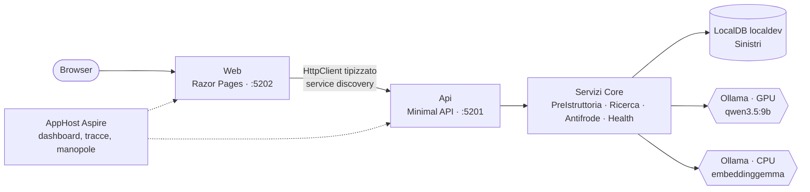

# Fase 8 — API e UI web per la demo live

> Riferimento: `PLAN.md` §1 punto 7 e §4 Fase 8. Impianto come `Crm.Web` / `Erp.Web` di `AI.POC-OrderToCash`: **Razor Pages** (D16), avvio da **AppHost Aspire** (D15).
> Include il punto 3 della Fase 10 (Minimal API + pagina), decisione D14.

## Obiettivo

Condurre **tutta la demo dal browser**: pre-istruttoria, ricerca clausole, ricerca storico ibrida, antifrode, stato del sistema. La logica resta nei servizi applicativi di `Core`; endpoint e pagine sono sottili (convenzione `code-operations`: niente logica di business negli endpoint).

---

## 1. Architettura



- **Api** (`Dusiburg.AI.Sinistri.Api`): minimal API con `AddServiceDefaults()` / `MapDefaultEndpoints()`, connection string `sql` dall'AppHost, stesse estensioni DI della CLI (`AddSinistriCore/Data/Ai`). OpenAPI su `/openapi/v1.json` e un file `Api.http` con le richieste pronte, come `Erp.Api.http` in O2C.
- **Web** (`Dusiburg.AI.Sinistri.Web`): Razor Pages, **nessun accesso al DB né a Ollama**, solo HTTP verso l'API (stessa regola di O2C per le UI). Client tipizzato `SinistriApiClient` con base address `http://api` (service discovery Aspire, `WithReference(api)`), più una classe `…Presentation` per formattazioni ed etichette (come `DealPresentation` in O2C). Testi italiani con `WebEncoderOptions` su `UnicodeRanges.All`, come in O2C.
- Porte fisse nei `launchSettings.json`: Api `5201`, Web `5202` (O2C usa 5101–5106).
- Nessuna autenticazione (non-obiettivo del piano).

### Timeout e resilienza dei client HTTP (attenzione)

ServiceDefaults attiva per tutti i client il resilience handler standard, che taglia i tentativi a pochi secondi e ritenta. Una pre-istruttoria dura 15–40 s e non va ripetuta. Quindi la Web registra **due** client:
- `SinistriApiClient` per le **letture** (polizze, health, ricerche): resilienza standard, i retry non fanno danni (come in `Erp.Web`);
- `PreIstruttoriaApiClient` per `POST /api/pre-istruttoria` e `POST /api/antifrode/scan`: **senza** retry, timeout di tentativo e totale a 5 minuti (resilience handler rimosso o configurato apposta per quel client; la forma esatta va verificata sulla versione di `Microsoft.Extensions.Http.Resilience`).

---

## 2. Endpoint API

Tutti sotto `/api`, JSON camelCase, enum come stringhe, errori come `ProblemDetails` (404 polizza inesistente, 422 polizza non in vigore, 503 Ollama/SQL non raggiungibili).

| Metodo | Percorso | Input | Output | Servizio |
|---|---|---|---|---|
| GET | `/health` | — | health check ASP.NET (anche per Aspire) | ServiceDefaults + probe |
| GET | `/api/health` | — | lista dei controlli con dettaglio (come `health` della CLI) | `HealthService` |
| GET | `/api/statistiche-dataset` | — | conteggi per tabella, sinistri per causa × stato, `EmbeddingInfo` | `DatasetService` |
| GET | `/api/polizze?cerca=&top=20` | testo su numero o contraente | elenco polizze, demo per prime | `PolizzaQueryService` |
| GET | `/api/polizze/{numero}` | — | `DatiPolizza` | idem |
| GET | `/api/riparatori` | — | `Id`, ragione sociale | idem |
| GET | `/api/scenari-demo` | — | i 6 scenari del `DemoCatalog` | `DemoCatalog` |
| POST | `/api/pre-istruttoria` | `RichiestaPreIstruttoria` | `EsitoPreIstruttoria` | `PreIstruttoriaService` |
| POST | `/api/pre-istruttoria/markdown` | `EsitoPreIstruttoria` | `text/markdown` (download) | `SchedaMarkdownRenderer` |
| POST | `/api/clausole/ricerca` | testo, prodotto, top | `RisultatoRicercaClausole` | `RicercaService` |
| GET | `/api/clausole/{id}` | — | clausola completa | `ClausolaRepository` |
| POST | `/api/sinistri/ricerca` | testo + `FiltriStorico` + top | simili + statistiche + tempi | `RicercaService` |
| GET | `/api/sinistri/{numero}` | — | dettaglio sinistro | `SinistroRepository` |
| POST | `/api/antifrode/scan` | mesi, soglia | coppie + precision/recall se esistono i duplicati attesi | `AntifrodeService` |

- Gli endpoint accettano `CancellationToken`: chiudendo la pagina la generazione si interrompe.
- **Warm-up all'avvio** dell'API (`IHostedService`): un embedding e una chat minima, così il primo utente della demo non paga il caricamento dei modelli. Si disattiva con la manopola `SINISTRI_WARMUP=false`, inoltrata dall'AppHost.
- Endpoint suddivisi per area in classi statiche `…Endpoints.MapXxx()` (`PolizzaEndpoints`, `PreIstruttoriaEndpoints`, …), come `OrderEndpoints` in O2C.

---

## 3. Pagine (Razor Pages)

Layout condiviso (`Pages/Shared/_Layout.cshtml`): barra di navigazione, indicatore di stato (verde/rosso da `/api/health`), nomi dei modelli in uso e dove girano (GPU/CPU, da `/api/ps` tramite `health`). CSS semplice in `wwwroot/css`, come nelle UI di O2C; JavaScript minimo e solo dove serve (indicatore di attesa, pannello della clausola).

### 3.1 `Pages/Index` — Pre-istruttoria (pagina iniziale)

- Form: polizza (campo con elenco suggerito dall'API; le 3 polizze demo in cima), testo della denuncia, campi facoltativi data evento, causa (filtrata per prodotto), riparatore.
- **Pulsanti degli scenari demo 1–4**: link `?scenario=1…4` che precompilano il form dal `DemoCatalog`.
- "Genera scheda" = POST della pagina → handler `OnPostAsync` → `PreIstruttoriaApiClient`. Durante l'attesa uno script di poche righe disabilita il pulsante e mostra un indicatore con il tempo trascorso.
- Risultato (stessa pagina):
  - card della scheda: garanzie (verde), esclusioni da verificare (arancione), franchigia (blu), punti da chiarire, valutazione sintetica;
  - ogni **articolo citato è un link** che apre il testo integrale della clausola in un pannello (`<dialog>` HTML con il testo già presente nella pagina, niente chiamate extra): è il punto chiave della demo, la citazione si verifica;
  - tabella dei sinistri simili (numero → pagina di dettaglio `Pages/Sinistri/Dettaglio`);
  - riquadro statistiche con la dicitura *"calcolate dal database, non dal modello"*;
  - riquadro antifrode, avvisi della validazione, clausole consultate (distanza, "integrativa");
  - tempi per passo e link **"apri la traccia nel dashboard"** (trace id della richiesta, come i collegamenti fra portali di O2C);
  - pulsante "Scarica Markdown".

### 3.2 `Pages/Clausole/Ricerca` — pilastro A

Testo + prodotto → tabella con la distanza mostrata anche come barra orizzontale. Mostra "cosa vede il modello" e la vicinanza tra garanzie ed esclusioni.

### 3.3 `Pages/Storico/Ricerca` — pilastro B

Testo + filtri (prodotto, provincia, importo minimo, causa, anni) → tabella dei simili e riquadro statistiche. Il link "scenario 5" compila i filtri. Tempi separati (embedding e query SQL) per far vedere che la ricerca ibrida è una sola query.

### 3.4 `Pages/Antifrode/Index`

Mesi + soglia → coppie con le due descrizioni affiancate e il motivo. Se esiste `duplicati_attesi.json`: tabella precision/recall per le soglie standard, coppie attese marcate ✓.

### 3.5 `Pages/Stato/Index`

Risultato di `/api/health`, conteggi del dataset, `EmbeddingInfo`, parametri di retrieval in sola lettura. `DbInit` ed `embed` restano **solo da riga di comando** (distruttivi o lunghi, non servono in demo).

### Streaming (facoltativo)

Con Razor Pages la risposta arriva in un'unica volta dopo 15–40 s; l'indicatore di attesa e i tempi per passo bastano per la demo, e il dettaglio dei passi si vede comunque nel dashboard di Aspire. Variante da decidere in review: endpoint SSE `POST /api/pre-istruttoria/stream` (un evento per passo completato) consumato da un piccolo script nella pagina. Stima: +½ giornata.

**Deciso il 2026-09-28: streaming SSE.** Il browser non vede l'API, quindi la catena è browser → Web → API:
- API `POST /api/pre-istruttoria/stream` (`text/event-stream`, `TypedResults.ServerSentEvents`): eventi `passo` (`AvanzamentoPreIstruttoria`, all'inizio e alla fine di ogni passo), poi `esito` (`EsitoPreIstruttoria`) oppure `errore` (`ProblemDetails`: a stream partito il codice HTTP è già 200);
- Web `POST /pre-istruttoria/stream` (JSON dallo script): legge lo stream dell'API con `SseParser`, inoltra i passi come {passo, secondi}, salva l'esito in `EsitiRecenti` (cache in memoria, 2 ore) e chiude con `fine` {url: `/?esito={id}`};
- la pagina carica l'url ricevuto: la scheda la disegna sempre Razor, niente rendering in JavaScript. Senza JavaScript il form fa il POST classico con post-redirect-get sullo stesso url.

---

## 4. Avvio della demo

```powershell
dotnet run --project tools/Dusiburg.AI.Sinistri.DbInit        # una tantum: DB + dati sintetici
dotnet run --project src/Dusiburg.AI.Sinistri.Cli -- embed      # una tantum: vettori
dotnet run --project src/Dusiburg.AI.Sinistri.AppHost           # api + web + dashboard
```

- Il dashboard di Aspire mostra `api` e `web` con lo stato di salute. Se Ollama è spento, `api` è rossa con il messaggio del probe.
- Le manopole (`OLLAMA_CHAT_MODEL`, `SOGLIA_DUPLICATO_COSINE`, …) si cambiano sull'AppHost (user-secrets o riga di comando) senza toccare i progetti, come in O2C; documentate in `docs/demo.md` (Fase 9).
- `launchSettings.json` dell'AppHost con `launchBrowser` sul dashboard; dal dashboard si apre la Web.

---

## 5. Test introdotti in questa fase (`tests/Dusiburg.AI.Sinistri.Web.Tests`)

Come `Dusiburg.AI.O2C.Web.Tests`: `WebApplicationFactory` su Api e Web; per la Web l'API è sostituita da uno `StubApiHandler` con risposte preparate.

| Test | Cosa verifica |
|---|---|
| `ApiEndpointTests.Health_RestituisceControlli` | 200 e forma della risposta (probe finti) |
| `ApiEndpointTests.PreIstruttoria_PolizzaInesistente_404` | `ProblemDetails` 404 |
| `ApiEndpointTests.PreIstruttoria_PolizzaNonInVigore_422` | `ProblemDetails` 422 |
| `ApiEndpointTests.SinistriRicerca_PassaIFiltri` | i filtri arrivano al servizio (stessa chiamata ripetuta con filtri diversi) |
| `WebPageTests.Index_Scenario1_PrecompilaIlForm` | `?scenario=1` → polizza e testo precompilati |
| `WebPageTests.Index_EsitoConCitazioni_MostraLinkAlleClausole` | ogni articolo citato ha il suo `<dialog>` con il testo |
| `WebPageTests.Index_ApiNonRaggiungibile_MessaggioChiaro` | nessuna eccezione a video |
| `PresentationTests.*` | formattazione di importi, distanze, stati ed etichette in italiano |

## 6. Criteri di completamento — checklist manuale della demo

Con l'AppHost avviato:

- [ ] Dashboard: `api` e `web` sane; pagina Stato tutta verde, conteggi coerenti con la Fase 3, embedding su CPU e chat su GPU.
- [ ] Scenari demo 1–4 dalla pagina Pre-istruttoria: scheda completa, articoli cliccabili, statistiche, tempi, traccia nel dashboard.
- [ ] Una denuncia che riformula un sinistro esistente mostra il riquadro antifrode.
- [ ] Polizza inesistente → messaggio d'errore chiaro.
- [ ] Scenario 5 dalla pagina Ricerca storico; scenario 6 dalla pagina Antifrode con precision/recall.
- [ ] Download del Markdown di una scheda.
- [ ] Spegnendo Ollama: `api` rossa nel dashboard, indicatore rosso nella Web, messaggio comprensibile.
- [ ] Build della solution e test verdi.

## 6 bis. Esito (2026-09-28)

### Verifiche eseguite

Con l'AppHost avviato (CLI di Aspire 13.5.4, dashboard su `https://localhost:17379`) e con API e Web anche da sole, su DB `Sinistri` e Ollama reali; le richieste sono state fatte via HTTP, non da un browser:

| Punto della checklist | Esito |
|---|---|
| `api` e `web` sane | risorse `Running`, `/health` dell'API `Healthy`; pagina Stato con 9 controlli OK, indicatore "sistema pronto" |
| Scenari demo dalla pagina | scenari 2 e 4 e la riformulazione di `SIN-2026-000024` tramite lo stream della Web: 15–23 s, 7 passi, scheda con 5 `<dialog>` delle clausole e pulsanti sugli articoli citati, statistiche "calcolate dal database", tempi per passo |
| Traccia nel dashboard | link `https://localhost:17379/traces/detail/{traceId}`, trace id della richiesta del browser propagato all'API (W3C) |
| Riquadro antifrode | `SIN-2026-000024`, stesso contraente, 0,057 |
| Polizza inesistente | API 404 `ProblemDetails`; nello stream evento `errore` "Polizza inesistente: La polizza … non esiste." |
| Scenari 5 e 6 | pagine Storico (`?scenario=5`) e Antifrode (`?scenario=6`) con risultati e tabelle precision/recall |
| Download Markdown | `text/markdown`, `scheda-CF-DEMO-000001-yyyyMMdd-HHmm.md`, stesso renderer della CLI |
| Ollama spento | simulato con `OLLAMA_ENDPOINT=http://127.0.0.1:11999` sull'AppHost (senza fermare Ollama): API `/health` 503, indicatore rosso "sistema non pronto" con il motivo nel tooltip, stream con "Modello non raggiungibile: Ollama non risponde: …" |
| Build e test | solution senza warning; 146 test verdi (13 in più nel progetto Web.Tests) |

Da guardare a occhio al primo avvio (non verificabile senza browser): impaginazione delle pagine, avanzamento dei passi a video (lo script ha la sintassi verificata con Node e il parser SSE provato con uno stream spezzato in pezzi), apertura della traccia nel dashboard.

### Scostamenti

| Punto | Previsto | Fatto | Motivo |
|---|---|---|---|
| Attesa della generazione | indicatore di attesa, SSE facoltativo | SSE (decisione in review), con fallback senza JavaScript | vedi "Streaming" |
| Client senza retry | forma da verificare | `RemoveAllResilienceHandlers()` + `HttpClient.Timeout` 5 minuti | API marcata sperimentale (EXTEXP0001, soppressa solo lì): l'alternativa per nome di pipeline è più fragile |
| `PolizzaQueryService`, `DatasetService` | servizi Core | un `IConsultazioneRepository` (Data), chiamato dagli endpoint | pure letture senza logica: un servizio in più non aggiungerebbe nulla |
| Endpoint | tabella del §2 | in più `GET /api/configurazione` | parametri in sola lettura della pagina Stato |
| Errori | `ProblemDetails` | in più 400 per JSON malformato e validazione, e log degli errori | in .NET 10 il middleware non registra più le eccezioni gestite da un `IExceptionHandler` |
| Scenari nei pulsanti | `/api/scenari-demo` | `DemoCatalog` letto dalla Web (Core); l'endpoint resta per l'API | nessuna chiamata per dati costanti |
| Contratti API/UI | — | in Core (`Consultazione/ContrattiApi.cs`), con `SinistriJson` (enum come stringhe) su entrambi i lati; `EmbeddingInfo` e i conteggi del seed spostati da Data a Core | la Web referenzia solo Core |
| Scheda senza JavaScript | — | POST classico, poi redirect a `/?esito={id}` | ogni scheda ha un indirizzo, anche per il download |
| Test | tabella del §5 | in più: stream dell'API letto dal client della Web (verifica il contratto SSE dai due lati), stream della Web (passi, fine, errore, API giù), Markdown uguale alla CLI | |

Nota operativa: se all'avvio dell'AppHost la risorsa `api` va in `FailedToStart`, controllare che non sia rimasta attiva un'API avviata a mano sulla porta 5201.

## 7. Commit proposto (non eseguito)

```
fase 8: API minimale e interfaccia Razor Pages per la demo, avviate da Aspire

Api: endpoint per area (sistema, anagrafiche, pre-istruttoria, ricerche,
antifrode), errori come ProblemDetails (404, 422, 503, 400), stream SSE
dei passi della pre-istruttoria, Markdown della scheda, warm-up dei modelli,
OpenAPI e Api.http. ConsultazioneRepository per polizze, riparatori,
clausola, sinistro e statistiche del dataset; contratti API/UI in Core.
Web: pagine Pre-istruttoria (scenari 1-4, passi in streaming, scheda con
articoli che aprono il testo della clausola, antifrode, statistiche, tempi,
link alla traccia, download Markdown), Clausole, Storico, Sinistro,
Antifrode con precision/recall, Stato; indicatore di stato nel layout.
Due client HTTP: letture con il resilience handler, pre-istruttoria e
fraud-scan senza retry e con timeout di 5 minuti.

Verifica: build della solution, 146 test verdi, demo sotto l'AppHost con
DB e Ollama reali e con Ollama simulato irraggiungibile.
```
